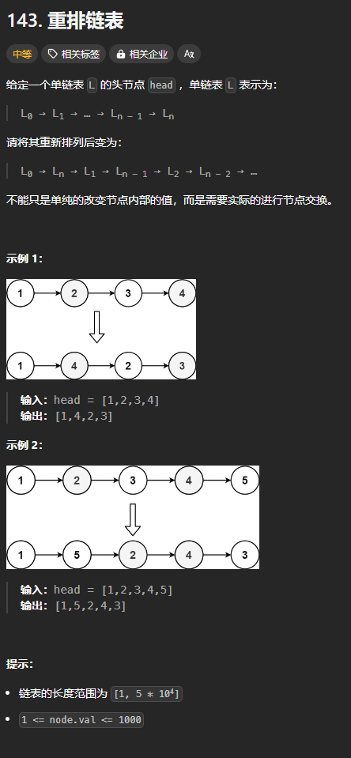
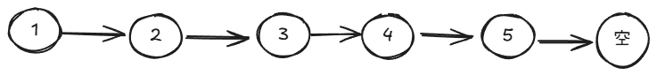
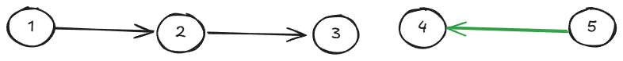
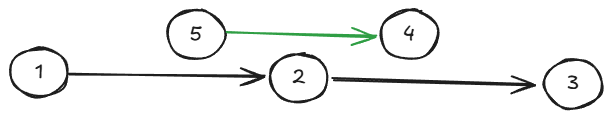
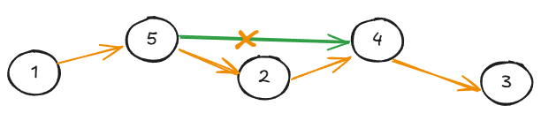

题目链接：[https://leetcode.cn/problems/reorder-list/](https://leetcode.cn/problems/reorder-list/)



## 思路
假设有如下链表：



思路就是，反转后面的**半段**，这里可以使用快慢指针来找到链表的中间节点 3，然后反转其后面的节点**：**



然后，将其放到合适的位置中：



然后，就是“链接”：



## 代码
```go
func reorderList(head *ListNode)  {
    findMiddleNode := func (head *ListNode) *ListNode {
        slow, fast := head, head 
        for fast != nil && fast.Next != nil {
            slow = slow.Next
            fast = fast.Next.Next
        }
        return slow
    }

    middleNode := findMiddleNode(head)

    // 反转后面的节点
    var prev, cur *ListNode = nil, middleNode.Next
    middleNode.Next = nil
    for cur != nil {
        next := cur.Next
        cur.Next = prev
        prev = cur
        cur = next
    }

    // 反转过后， prev 就是后面半段链表的头结点
    // 接下来，就是合并两个链表
    a, b := head, prev
    for b != nil {
        aNext := a.Next
        bNext := b.Next

        a.Next = b
        b.Next = aNext

        a = aNext
        b = bNext
    }
}
```

