## 概述

词法分析是编译的第一个阶段，其主要任务包括：

- 读入源程序的输入字符，将它们组成词素，生成并输出一个词法单元序列
- 将词素加入到符号表中，在某些情况下，还会从符号表中读取有关标识符种类的信息，以确定向语法分析器传送哪个词法单元
- 过滤掉源程序中的注释和空白
- 将编译器生成的错误消息与源程序的位置联系起来
- 如果有宏，则宏的扩展也由词法分析其完成

词法分析器一般由语法分析器调用：

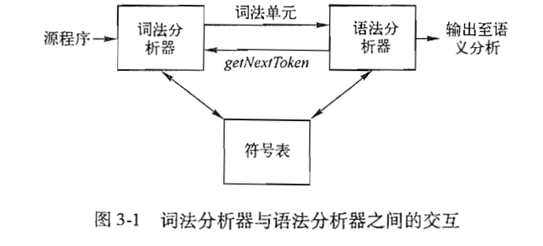

语法分析器不断地调用 `getNextToken`，直到词法分析器没有更多的词素。

有时，词法分析器分为 2 个处理阶段：

1. **扫描阶段**：完成一些不需要生成词法单元的简单处理，例如删除注释、宏看开、将多个空白字符合并成一个等
2. **词法分析**阶段：处理扫描阶段的输出并生成词法单元

区分**词法单元**、**模式**和**词素**这 3 个术语：

- **词法单元**：由一个**词法单元名**和一个可选的**属性值**组成。词法单元名可能是一个关键字，也可能是一个标识符。
- **模式**：描述了词法单元的词素可能具有的形式。
- **词素**：是源程序中的字符序列，和某个词法单元的模式匹配，并被词法分析器识别为该词法单元的一个实例。

下面是这 3 者的示例：

| **词素（Lexeme）** | **词法单元（Token）** | **模式（Pattern）**      | 说明       |
| ------------------ | --------------------- | ------------------------ | ---------- |
| `if`               | `KEYWORD_IF`          | `if`                     | 固定关键字 |
| `count`            | `IDENTIFIER`          | `[a-zA-Z_][a-zA-Z0-9_]*` | 标识符     |
| `==`               | `OP_EQ`               | `==`                     | 等于操作符 |
| `100`              | `NUMBER`              | `[0-9]+`                 | 整数       |

词法单元可以写成 `<词法单元名, 属性>` 的格式，例如下面是 `E = M * C ** 2` 的词法单元：

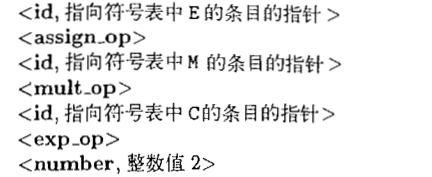

## 输入缓冲

输入缓冲用以解决一个词素由多个字符组成这种普遍存在的情况。

### 缓冲区对

为了节省读入字符的时间，使用了 2 个**交替读入**的缓冲区组成一个缓冲区对。

每个缓冲区的大小为 N + 1，N 的值一般为一个磁盘块的大小。多余的一个字符是一个特殊字符 EOF 用来表示缓冲区的结束。

如果输入文件中的剩余字符不足 N 个，则会使用一个特殊的 `EOF` 字符来标记源文件的结束。

缓冲区对中，维护了 2 个指针：

- lexmeBegin 指针：指向当前词素的开始处
- forword 指针：一直向前扫描，直到发现**某个模式**被匹配为止

当 forword 指针指向 `EOF` 时，它检查该位置是否是该缓冲区的尾部，如果是，则读取 N 个字符到另一个缓冲区中，并将 forword 指针指向另一个缓冲区的头部。

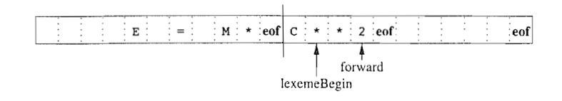

## 词法单元的识别

根据下面的文法以及对应的词法单元模式来展开：

文法：

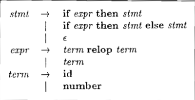

词法单元模式：

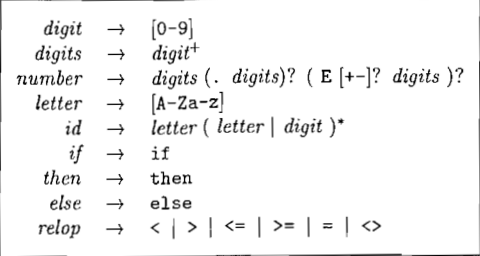

下面是词法单元对应的属性值：

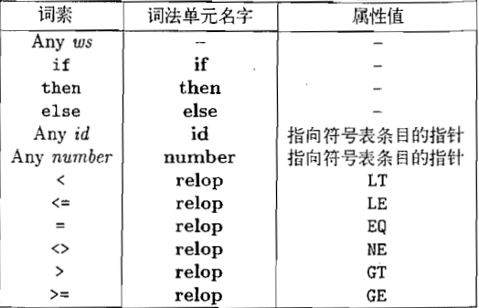

### 消除空白字符

可以使用如下文法：

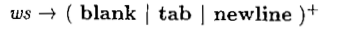

识别到 ws 之后，不将其返回给语法分析器，而是继续识别。

### 状态转换图

状态转换图可以确定返回哪个词法单元与属性值：

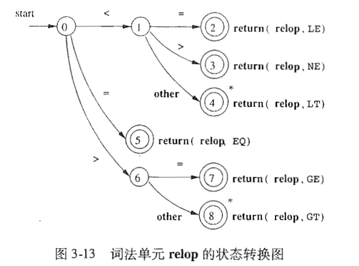

其中的 `*` 表示需要将 forword 指针回退一个或多个位置。

下面是上图对应的代码实现：

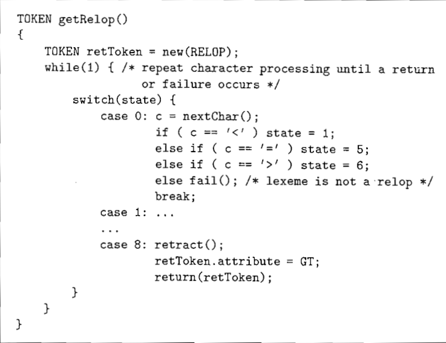

其中，`retract` 用于将 forword 指针回退一个位置。

`fail` 函数用于重置 forword 指针，并启动下一个状态转换图，使得可以为每个关键字使用单独的状态转换图。

#### 保留字（关键字）和标识符的识别

为了使上述状态转换图可以识别标识符和关键字，在其中添加如下状态转换图：

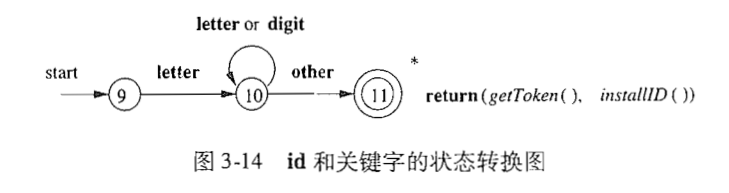

为了使上述状态图能够识别关键字，需要事先将关键字放入符号表中。

其中，`getToken` 从符号表中取得词法单元，可能有 2 种情况：

- 关键字
- `id` 词法单元

`installID` 将标识符放入符号表中，并返回一个指针，指向该标识符对饮的符号表条目。

#### 无符号数字的识别

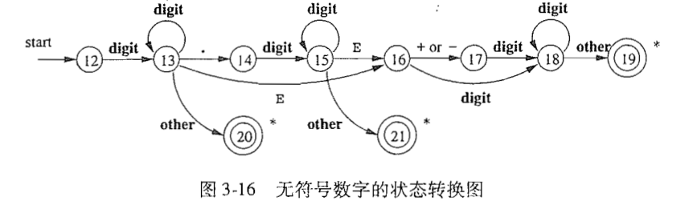

#### 空白字符的识别

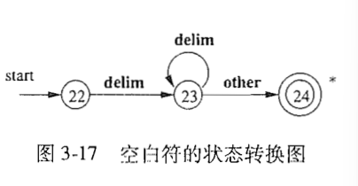

识别了之后，不返回词法单元，而是重新开始词法分析识别过程。

