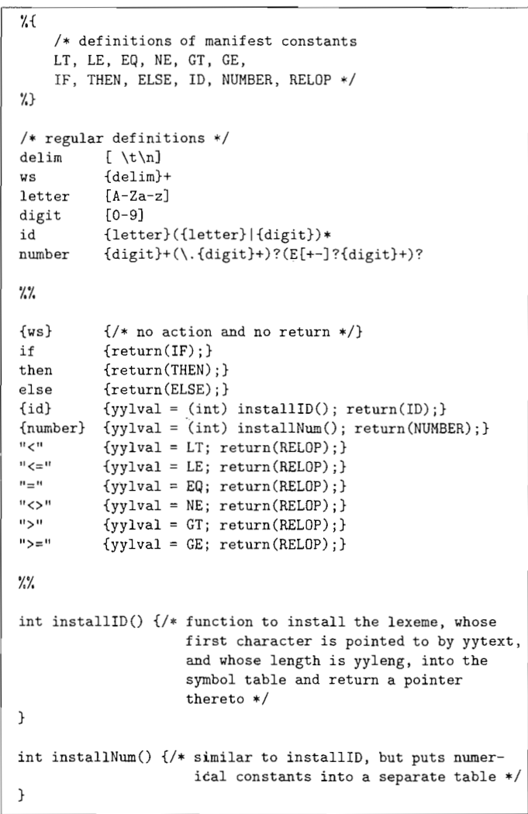

Lex 编译器将 Lex 语言所表示的**模式转换成状态转换图**，并**生成相应的实现代码**。

lex 将 lex.l 文件转换成 C 语言程序，存放该程序的文件名是 lex.yy.c 。

lex 源文件具有如下文件格式：

```
声明部分
%%
转换规则
%%
辅助函数
```

声明部分包含变量和明示常量（`manifest constant`）。

转换规则具有如下格式：

```
模式 { 动作 }
```

lex 通常与 yacc 共同使用，两者有一个共享的整形变量 `yylval`。

lex 与 yacc 按照如下方式协作：

- yacc 调用  lex
- lex 找到一个最长的与某个模式匹配的词素，然后，语法分析器执行相关的动作 A
- 动作 A 一般会将控制权返回给 yacc（即语法分析器），但是，如果遇到空白符、注释等，就不返回控制权，而是继续寻找其他的词素
- lex 只返回词法单元名，在需要时可以使用功能 yylval 来传递有关这个词法单元的附加信息

lex 源文件中的 `%{ ... }%` 中可以包含 C 语言代码，并且其中的所有 C 语言代码都会被复制到 lex.yy.c 文件中。

辅助函数部分的函数也会被复制到 lex.yy.c 文件中。

下面是 lex 的示例：



上述代码中的 `%{ ... }%` 中定义的常量要使用 `#define` 来赋一个唯一的整数值。

`yytext` 是一个指向词素开头的指针，类似于 lexmeBegin 指针，`yyleng` 是该词素的长度。这 2 者是内置的，不用自己声明。

如果输入的多个前缀与一个或多个模式匹配，则 Lex 利用如下问责来选择正确的词素：

1. 总是选择最长的前缀
2. 如果最长的可能前缀与多个模式匹配，总是选择在 lex 文件中先被列出来的模式

## 向前看运算符

Lex 自动向前读入一个字符，则它会读取到形成词素的全部字符的后一个字符，然后再回退输入，使得只有词素本身从输入中消耗掉。

但是，在关键字没有被保留的时候，例如 Fortran：

```fortran
IF(I, J) = 3 ! 这是一个数组

IF (condition) THEN ... ! 这是一个关键字
```

为此，可以在 Lex 模式中使用 `/` 来指定当 `IF` 后跟一个指定的模式的时候，它才是一个关键字：

```
IF / \(.*\) {letter}
```

其中的 `.` 表示除了换行符之外的其它字符。

`(` 和 `)` 前都加了 `\` 进行转义。