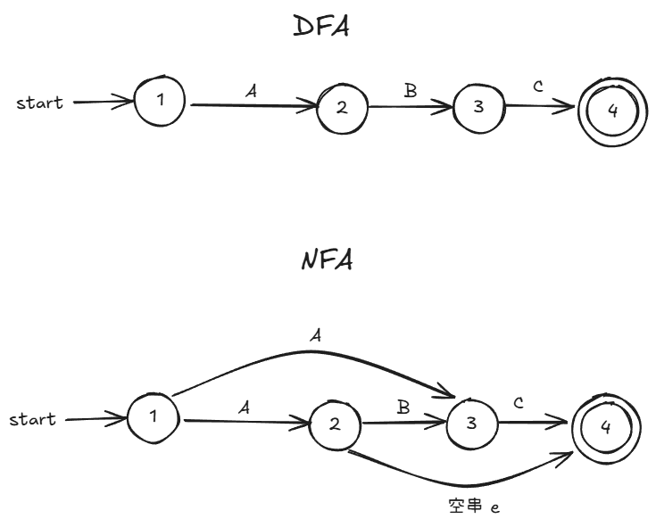
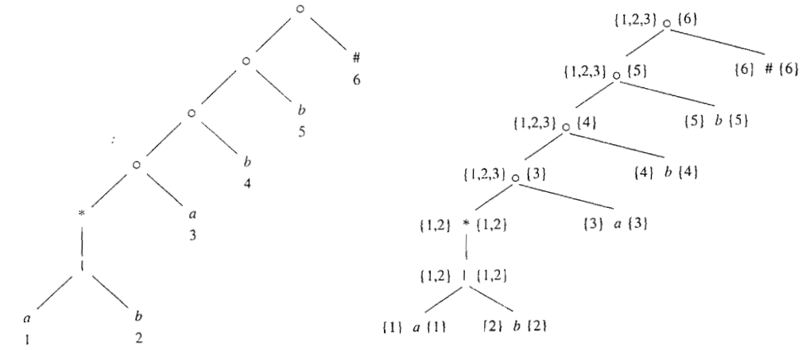

## 有穷自动机（Finite Automata）

FA 是一个**识别器（recongnizer）**，只能对每个可能的输出串简单地回答“是”或“否”。

FA 分为 2 类：

- **不确定的有穷自动机（Nondeterministic Finite Automata, NFA）**:在一个状态上可能有零条、一条甚至多条关于某一个符号的出边。并且，空串（$\epsilon$）也可以是该状态的某个出边。
- **确定的有穷自动机（Deterministic Finite Automata，DFA）**：至多只有 1 条关于某一符号的出边。并且，不允许 $\epsilon$ 转移。



DFA 和 NFA 的能力是相同的，而且识别都能够用正则表达式描述的语言。这个用正则表达式描述的语言的集合被称为**正则语言（regular language）**。

无论是 DFA 还是 NFA，都可以将它表示为一张转换图（transition graph），节点是状态，带有标号的边表示自动机的转换函数。

## NFA

NFA 由如下几个部分组成：

1. 一个有穷的状态集合 S
2. 一个输入符号集合 $\Sigma$，即**输入字母表**，假设代表空串的 $\epsilon$ 不是 $\Sigma$ 中的元素
3. 一个**转换函数（transition function）**，它为每个状态和 $\Sigma \cup \{ \epsilon \}$ 中的每个符号都给出了对应的后继状态的集合。
4. S 中的一个状态 $S_0$ 被指定为开始状态（初始状态）
5. S 的一个子集 F 被指定为接收状态（终止状态）集合

例如，下面是可以识别 `(a|b)*abb` 的 NFA 的转换图：


### 转换表

可以将一个 NFA 表示为一张转换表，表的各行对应于状态，各列对应输入符号（包括 $\epsilon$）。每个单元格的值是转换函数以状态和符号为输入后，计算出来的结果的集合：


只要存在某条路径能够从开始状态达到某个接收状态，NFA 就会接受这个符号串。

## DFA

DFA 是 NFA 的一个特例：

- DFA 没有输入 $\epsilon$  的转换动作
- 每个状态 s 和每个输入符号 a，有且只有一条标号为 a 的边离开 s

由上述 2 条性质决定，转换表的每个单元格都只有一个元素。

下图是接收 `(a|b)*abb` 的 DFA：


在构造分词器的时候，实现/模拟的是 DFA。下面的方法说明了如何将 DFA 用于子串的识别：


其中，$F$ 表示终止状态集，转换函数为 `move`。

## 从正则表达式到 FA

从正则表达式转换到 FA 一般是：

1. 将正则表达式转换到 NFA
2. 将 NFA 转换到 DFA

### 从 NFA 到 DFA 的转换

使用**子集构造法**来完成 NFA 到 DFA 的转换。

子集构造法的基本思想是让构造得到的 DFA 的每个状态对应于 NFA 的一个状态集合。

例如，在 NFA 中仅有 `s0` 到 `s1` 和 `s2`，那么 DFA 中，就将集合 `{s1、s2}` 作为 DFA 的一个状态。

假设 NFA 状态集合是：`{q0, q1, q2}`，那么 DFA 的状态就可能是这些子集：

- `{q0}`
- `{q1}`
- `{q2}`
- `{q0, q1}`
- `{q1, q2}`
- `{q0, q1, q2}`
- 甚至 `{}`（表示空集合，DFA 中表示“死状态”）

所以，DFA 的状态数有可能是 NFA 状态数的指数，但是，在真实的语言中，NFA 和 DFA 的状态数量大致相同。

#### 算法

此算法的输入：

- 一个 NFA，记为 N

输出为：

- 一个 DFA，记为 D

转换的方法是为 D 构造出一个**转换表** Dtran，D 的每个状态是一个 NFA 状态集合，使得 D “并行地”模拟 N 在遇到一个给定输入串时可能执行的所有动作。

定义如下函数：

| 操作                  | 描述                                                         |
| --------------------- | ------------------------------------------------------------ |
| $\epsilon$-closure(s) | 能够从 NFA 的状态 $s$ 开始只通过 $\epsilon$ 转换到达的 NFA 状态集合 |
| $\epsilon$-closure(T) | 能够从 $T$ 中某个 NFA 状态 $s$ 开始只通过 $\epsilon$ 转换到达的 NFA 状态集合，即 $$\bigcup_{s \in T} \epsilon\text{-closure}(s)$$ |
| move(T, a)            | 能够从 $T$ 中某个状态 $s$ 出发通过标号为 $a$ 的转换到达的 NFA 状态的集合 |

其中，s 表示 N 的单个状态，T 表示 N 的一个状态集。

下面的 Dstates 表示 D 的状态集合：


解释：

1. 在读入第一个输入符号之前，N 可以位于集合 $\epsilon-closure(s_0)$ 中的任何状态上，其中，$s_0$ 是 N 的初始状态
2. 假定 N 在读入输入 x 之后，位于集合 T 中的状态上
3. 如果下一个输入符号是 a，则 N 可以立即移动到集合 move(T, a) 中的任何状态上；但是，N 也可以在读入 a 之后，再执行 $\epsilon$ 转换，因此 N 在读入 xa 之后，可能位于 $\epsilon-closure(move(T, a))$ 中的任何状态上。

其中，计算 $\epsilon-closure(T)$ 的计算过程如下：


#### 示例

有 `(a|b)*aab` 的 NFA：


1. NFA 的开始状态是 $\epsilon-closure(0)$，即 $A = \{0, 1, 2, 4, 7\}$，即从状态 0 出发，只经过标号为 $\epsilon$ 的路径能够到达的所有状态。因为路径可以不包括边，所以 0 也在 A 中
2. NFA 中的输入字母表是 $\{a, b\}$
3. 标记 A，并计算 $Dtran[A, a] = \epsilon-closure(move(A, a))$ 和 $Dtran[A, b] = \epsilon-closure(move(A, b))$，分别另其结果为 $B$ 和 $C$
   - 其中，move(A, a) 的结果是 $\{ 3, 8 \}$
   - $\epsilon-closure(move(A, a))$ 的结果是 $\{ 1, 2, 3, 4, 6, 7 ,8 \}$，其中， 3 和 8 在的原因也是路径可以不包括边

最终，Dtran 的结果如下：


其状态转换图如下：


其中，上图比下图多了一个状态，这是因为状态 C 和状态 A 具有相同的状态转换函数，因此可以合并。


### 模拟 NFA 的执行

假设该 NFA 为 N，并且，其开始转态为 $s_0$，接受状态集为 $F$，转换函数为 $move$。

则有如下算法模拟 N 的执行：


算法使用到的数据结构：

1. 使用 2 个栈 oldStates 和 newStates 分别存放第 4 行中的左边的 S 和右边的 S
2. 一个以 NFA 状态为下标的布尔数组 alreadyOn，指示 newStates 中哪个状态已经存在，使用此布尔数组的目的是快速判断状态是否在 newStates 中已经存在
3. 使用一个二维数组 move[s, a] 存储 NFA 的转换表

算法的实现：

- 第一行：将 alreadyOn 数组中所有条目都设置为 false，然后对于 $\epsilon -closure(s_0)$ 中的每个状态 s，都将其压入 newStates 中，并设置 already[s] = true,如下述代码所示：

  ```java
  addState(s) {
  	将 s 压入栈 newStates 中;
  	alreadyOn[s] = true;
  	for (t on move[s, ε]) {
  		if (!alreadyOn[t]) {
  			addState(t);
  		}
  	}
  }
  ```

- 第四行：

  ```java
  for (oldStates 中的每个 s) {
  	// c 是下一个输入字符
  	for (move[s, c] 中的每个 t) {
  		if (!alreadyOn[t]) {
              // addState 更新 alreadyOn 数组的同时，计算 ε-closure(t)
  			addState(t);
  		}
  	}
  	
  	将 s 弹出 oldStates 栈;
  }
  
  for (newStates 中的每个 s) {
      将 s 弹出 newStates 栈;
      将 s 压入 oldStates 栈;
      alreadyOn[s] = FALSE;
  }
  ```

  上述算法的效率为 $O(k(n + m))$，k 为输入串的长度，n 为转换图的节点数，m 为转换图的边数。

### 从正则表达式到 NFA

使用 McMaughton–Yamada–Thompson 算法（也称 Thompson 构造法）可以完成此工作。

这个算法是语法制导的，即沿着正则表达式的语法分析树自底向上进行处理。

汤普森构造法将正则表达式拆分为多个子表达式，使得每个子表达式只包含一个终止状态。

假设 r 是一个正则表达式，则汤普森构造法使用如下规则对其进行拆分：

- 对于表达式 $\epsilon$ ，构造如下 NFA：

  

- 对于字母表中的子表达式 a，构造如下的 NFA：

  

- **合并规则**：如果正则表达式 s 和 t 的 NFA 分别是 N(s) 和 N(t)：

  -  r = s|t，则可以进行如下合并，下图的 i 和 f 状态是 r 的新状态，而不是 N(s) 或者 N(t) 的状态：

  

  - r = st，则按照如下方式构造 N(r)：

    

    - N(s) 的开始状态成为了 N(r) 的开始状态
    - N(t) 的终止状态成为了 N(r) 的终止状态
    - N(s) 的终止状态和 N(t) 的开始状态合并成一个状态，合并后的状态拥有原来进入和离开前的两个状态的全部转换

  - r = s*，则构造如下 N(r)：

    

  - r = (s)，那么 N(r) = N(s)

通过上述合并规则，有如下性质：

- N(r) 的状态数最多为 r 中出现的运算符和运算分量的总数的 2 倍。这是因为每一个构造步骤最多都只引入 2 个新状态
- N(r) 有且只有一个开始状态和接受状态，接受状态没有出边，开始状态没有入边
- N(r) 中除接受状态之外的每个状态要么有一条标号为 $\Sigma$ 中符号的出边，要么有两条编号为 $\epsilon$ 的出边

例如，r = `(a|b)*aab` 的 NFA 构造过程：

1. 语法分析树如下：


2. $r_3$ 的 NFA：


3. $r_5$ 的 NFA：


4. $r_7$ 的 NFA：


## DFA 模式匹配器的优化

### 从正则表达式到 DFA（不经过 NFA）

#### 重要状态

NFA 中，**重要状态**是指一个 NFA 的状态有一个标号为非 $\epsilon$ 的离开转换。

重要状态有如下性质，有如下性质：

- 只有重要状态 s 的 move(s, a) 才可能是非空的
- 每个重要状态对应于正则表达式中的某个运算分量（前提是使用汤普森构造法构造出来的 NFA）

在子集构造法中，如果两个 NFA 状态集合同时满足如下条件时，可以认为它两是一致的：

1. 具有相同的重要状态，且
2. 要么都包含接受状态，要么都不包含接受状态

可以通过**扩展的（augment）**正则表达式 `(r)#` 来使终止状态成为重要状态。

这样的话，在构造过程结束后，任何在 `#` 上有离开转换的状态必然是一个接受状态。

NFA 的重要状态直接对应于正则表达式中存放了字母表中符号的位置，使用抽象语法树来表示正则表达式会非常有用：


使用语法分析树来表示扩展的正则表达式具有如下很好的性质：

- 内部节点对应运算符
- 叶子节点对应运算分量

其中，`⚬` 、`|` 和 `*` 运算符的内部节点分别称为 cat 节点、or 节点 和 start 节点。

其中 `⚬` 表示连接运算符。

#### 根据抽象语法树计算得到的函数

要从一个正则表达式直接构造出 DFA，需要首先构造它的抽象语法树，然后计算如下 4 个函数：

- `nullable(n)`：对于一个抽象语法树的节点 n，当且仅当 n 代表的子表达式中可以生成空串 $\epsilon$  或者其本身就是空串时返回“真”。
- `firstpos(n)`：以节点 n 为根的子树中的位置集合，这些位置可以对应于以 n 为根的子表达式中某个串的第一个符号。
- `lastpos(n)`：以节点 n 为根的子树中的位置集合，这些位置对应于以 n 为根的子表达式中语言中某个串的最后一个符号。
- `followpos(p)`：p 代表抽象语法树中的位置，此函数返回一个集合，当且仅当存在匹配 `(r)#` 中的某个串 $x=a_1a_2···a_n$，可以将 x 中的某个 $a_i$ 与抽象语法树中的位置 p 匹配，并且位置 $a_{i + 1}$ 和位置 q 匹配，此时 q 才在返回的集合中。

`nullable`、`firstpos`、`lastpos` 的计算规则：

| 结点 $n$                     | nullable(n)                         | firstpos(n)                                                  | lastpos(n)                                                   |
| ---------------------------- | ----------------------------------- | ------------------------------------------------------------ | ------------------------------------------------------------ |
| 标号为 $\epsilon$ 的叶子结点 | $true$                              | $\emptyset$                                                  | $\emptyset$                                                  |
| 位置为 $i$ 的叶子结点        | $false$                             | $\{i\}$                                                      | $\{i\}$                                                      |
| or-结点 $n = c_1|c_2$        | $nullable(c_1) \lor nullable(c_2)$  | $firstpos(c_1) \cup firstpos(c_2)$                           | $lastpos(c_1) \cup lastpos(c_2)$                             |
| cat-结点 $n = c_1c_2$        | $nullable(c_1) \land nullable(c_2)$ | 若 $nullable(c_1)$，则 $firstpos(c_1) \cup firstpos(c_2)$；否则 $firstpos(c_1)$ | 若 $nullable(c_2)$，则 $lastpos(c_2) \cup lastpos(c_1)$；否则 $lastpos(c_2)$ |
| star-结点 $n = c_1^*$        | $true$                              | $firstpos(c_1)$                                              | $lastpos(c_1)$                                               |

下图是一个具体的例子：


---

下面研究如何计算 `followpos`：

只有 2 种情况会使得一个正则表达式的某个位置跟在另一个位置之后：

1. 如果 n 是一个 cat 节点，且其左右子节点分别为 $c_1、c_2$，那么对于 $lastpos(c_1)$ 中的每个位置 $i$，$firstpos(c_2)$ 中的所有位置都在 $followpos(i)$ 中
2. 如果 n 是一个 star 节点，且 $i$ 是 $lastpos(n)$ 中的一个位置，那么 $firstpos(n)$ 中的所有位置都在 $followpos(i)$ 中

示例：



得到的 followpos 如下图：


#### 实现

步骤：

1. 根据扩展正则表达式 `(r)#` 构建出一颗抽象语法树 T

2. 计算得到 T 的函数 `nullable`、`firstpos`、`lastpos` 和 `followpos`

3. 使用如下算法，构造出 DFA D 的状态集 Dstates 和 D 转换表 Dtran。

   - D 的状态就是 T 中的位置集合，每个状态最初都是“未标记的”，当开始考虑某个状态的离开转换时，就是“已标记的”。

   - D 的开始状态是 $firstpos(n_0)$，其中节点 $n_0$ 就是 T 的根节点

   - 这个 DFA 的接受状态集合是包含了结束标记 `#` 对应的位置的状态。

     

### 最小化 DFA 的状态数

如果分别从状态 s 和 t 出发，沿着标号为 x 的路径到达的 2 个状态中**只有一个**是接受状态，则称串 x **区分**状态 s 和 t。

如果存在某个能够区分状态 s 和状态 t 的串，那么它们就是**可区分的（distinguishable）**。

空串 $\epsilon$ 可以区分任何一个接受状态和非接受状态。

DFA 状态最小化算法的原理是：

1. 将 DFA 的状态集合划分为多个组，每个组中的各个状态之间相互不可再分
2. 将每个组中的状态合并成一个状态，此状态就是目标 DFA 中的一个状态

算法的步骤：

1. 构造包含 2 个组 F 和 S-F 的初始划分 $\Pi$，分别是 D 的接受状态组和非接受状态组

2. 应用下面的算法来构造新的分化 $\Pi_{new}$

   

3. 如果 $\Pi_{new} = \Pi$，则另 $\Pi_{final} = \Pi$，并执行步骤 4；否则，使用 $\Pi_{new}$ 替换 $\Pi$ 并重复执行步骤 2
4. 在分化 $\Pi_{final}$ 的每个组中选取一个状态作为该组的代表，这些代表构成了状态最少 DFA d' 的状态，D' 的其它部分按照如下步骤构建：
   1. D' 的开始状态是包含了 D 的开始状态的组的代表
   2. D' 的接受状态是包含了 D 的接受状态的组的代表
   3. 
      - 令 s 是 $\Pi_{final}$ 中某个组 G 的代表，并令 DFA D 中在输入 a 上离开 s 转换到 t。
      - 令 r 是 t 所在组 H 的代表
   4. D' 中存在一个从 s 到 r 在输入 a 上的转换

最小化算法某些时候会产生**死状态**，死状态是指在所有输入符号上都转向自己的非接受状态。

从 DFA 的完整性来讲，死状态是必须的。但是由于我们希望知道什么时候已经不存在能被这个包含死状态的 DFA 所接受可能性，所以，希望消除死状态。

这可以通过一个缺少了某些转换的自动机（严格意义来讲，其已经不是 DFA）来实现。

用作词法分析器 DFA 一般丢掉它的死状态，并所有消失的转换当做结束词法单元识别过程的信号。

词法分析器 DFA 同时也采用不同的初始分组方式：

- 把识别某个特定词法单元的所有状态放到对应于此词法单元的一个组中
- 把所有不识别任何词法单元的状态划分到另一组
- 一个死状态 $\{\phi \}$ 单独分为一组，并假设它输入字符的时候会转到自身

例如，有下列 DFA：


则有如下的初始组划分：


其中，$\{\phi\}$ 在 7 或 8 状态上输入 a 或者 b 的时候，会转向自身，并且，在 8、58、68 上输入 a 也会指向它。

