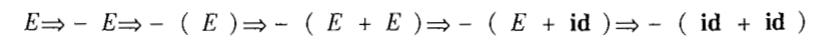
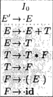
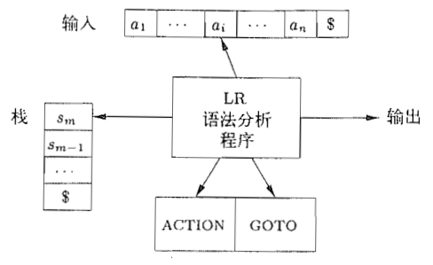
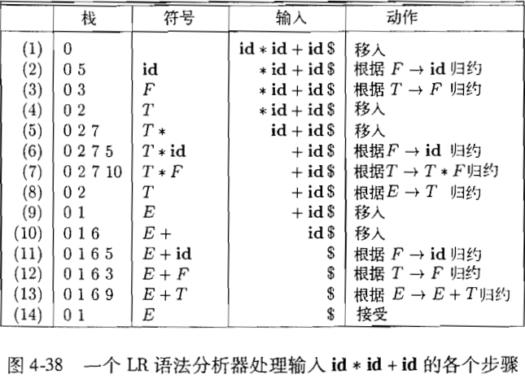

## 上下文无关文法

一个上下文无关文法由 4 个部分组成：

- 终结符号
- 非终结符号
- 开始符号：在一个文法中，某个非终结符号被指定为开始符号，这个符号表示的串集合就是这样文法生成的语言。按照惯例，首先列出开始符号的产生式。
- 一组产生式，每个产生式由 3 部分组成：
  - 一个被称为**产生式头**或**左部**的非终结符号
  - 符号 `->` 或者 `::=`
  - 由零个或多个终结符号与非终结符号组成的**产生式体**或**右部**，描述了左部的非终结符号所对应的串的某种构造方式

### 推导

例如文法：

可以推导出：

即 

如果 $S \Rightarrow \alpha$，其中 S 是文法 G 的开始符号，则 $\alpha$ 是 G 的一个**句型（sentential form）**，一个句型既可能包含终结符号又包含非终结符号，也可能是空串。

文法 G 的一个**句子（sentence）**是不包含非终结符号的句型。

例如上面的 $-(id + id)$ 就是一个句子。

上面的例子中，还有一种可以推导出该句子的推导过程：

这两种推导过程可以总结为：

- **最左推导（leftmost derivation）**：总是选择每个句型的最左侧非终结符号进行替换。如果 $\alpha \Rightarrow \beta$ 是一个推导步骤 ，且被替换的是 $\alpha$ 的最左非终结符号，则记作 $\alpha \underset{lm}{\Rightarrow} \beta$ 

- **最右推导（rightmost derivatino）**：总是选择每个句型的左右侧的非终结符号，记作 $\alpha \underset{rm}{\Rightarrow} \beta$

最右推导有时也被称为**规范推导（canonical derivation）**。

### 语法分析树和推导

语法分析树是推导的图形表示形式，它过滤掉了推导过程中对非终结符号应用产生式的顺序。即最左和最右推导得出来的分析树都是同一颗。

语法分析树的每个内部节点表示一个产生式的应用。每个内部节点的标号是此产生式头中的非终结符号 A。这个节点的子节点的标号从左到右组成了推导过程中替换 A 的产生式体。

例如：

一颗语法分析树的叶子节点可以是终结符号，也可以是非终结符号，**从左到右**排列语法分析树的叶子节点就可以得到一个**句型**，被称为该树的**结果（yield）**或**边缘（frontier）**。

### 二义性

如果一个文法可以为某个句子生成多棵语法分析树，则该文法就是具有**二义性（ambiguous）**的。

二义性文法就是对同一个句子有多个最左或最右推导的文法。

例如

中的句子

可以有 2 种推导过程：

分别得到 2 颗语法分析树：

其中，第二颗没有体现出 `*` 的优先级，是错误的。

### 上下文无关文法和正则表达式

文法是比正则表达式能力更强的表示方法。

每个可以使用正则表达式描述的构造都可以使用文法来描述，但是反之不成立。

比如，正则表达式 `(a|b)*abb` 和文法

描述的时同一语言。

可以使用如下步骤得到正则表达式对应的文法：

1. 对于 NFA 的每个状态 i，创建一个非终结符号 $A_i$
2. 如果状态 i 有一个在输入 a 上到达状态 j 的转换，则加入产生式 $A_i \rightarrow aA_j$。
3. 如果状态 i 在输入 $\epsilon$ 上到达状态 j，则加入产生式 $A_i \rightarrow A_j$
4. 如果 i 是一个接受状态，则加入产生式 $A_i \rightarrow \epsilon$
5. 如果 i 是 FA 的开始状态，则令 $A_i$ 为所得文法的开始符号

## 设计文法

### 消除二义性

示例，消除如下文法的二义性

其中

具有二义性：

消除二义性的核心思想是：每个 **else** 和最近的尚未匹配的 **then** 匹配。

在 then 和 else 之间出现的语句必须是“已匹配的”：

### 左递归消除

如果一个文法中有一个符号 A 使得对某个串 $\alpha$ 存在一个推导 $A \Rightarrow A\alpha$，那么这个文法就是左递归的。

自顶向下语法分析不能处理左递归文法，因此需要一个转换方法来消除左递归。

**立即左递归**是指 $A \rightarrow A\alpha$ 这种产生式。

对于更一般的产生式（相比于立即左递归产生式） $A \rightarrow A\alpha | \beta$，则可以通过如下转换来消除左递归：

进一步地，可以处理任意数量的 A 产生式：

其中，$\beta_i$ 都不以 A 开头，然后将 A 产生式替换为：

上述转换消除了立即左递归，但是没有消除因为 2 步或者多步推导而产生的左递归：

因为 $S \Rightarrow Aa \Rightarrow Sda$，所以 S 是左递归的，但不是立即递归的。

如下算法系统地消除了文法中的左递归。只要文法中不存在形如 $A \Rightarrow A$ 的文法环或 $A \rightarrow \epsilon$ 的 $\epsilon$ 产生式，就能保证消除左递归：

> **工作原理**
>
> 

### 提取左公因子

提取左公因子是一种文法转换方法，使用于预测分析技术或自顶向下技术的文法。

当不清楚应该在 2 个 A 产生式中如何选择时，可以通过改写产生式来推后这个决定，直到读取了足够多的输入，获得足够信息后再做出正确的选择。

比如，有 2 个产生式：

在输入 if 的时候，不知道使用哪个产生式。

更一般地，对于产生式 $A \rightarrow \alpha\beta_1 | \alpha\beta_2$ 可以将 A 展开为 $\alpha A'$ ，从而将作出决定的时间往后延，也就是：

其中，$\alpha$ 就被称为是该产生式的左公因子。

提取左公因子的方法是：

1. 对于每个非终结符号 A，找出它的 2 个或多个选项之间的最长公共前缀 $\alpha$ ，如果 $\alpha \neq \epsilon$，则将所有产生式 $A \rightarrow \alpha \beta_1 |\alpha \beta_2 | \alpha \beta_3 | ... |\alpha \beta_n | \gamma $ 替换为

其中，$\gamma$ 可以表示所有不以 $\alpha$ 开头的产生式体。

 

### 非上下文无关的语言构造

典型示例 1：标识符在程序中先声明，后使用，例如 wcw，第一个 w 表示某个标识符 w 的声明，c 表示中间的程序片段，第二个 w 表示对 w 标识符的使用。

例如如下语言：

这个 $L_1$ 不是上下文无关的。

在这种语言中，标识符是否是先声明后使用的，是在**语义分析阶段**检查的。

典型示例2：形参的个数和实参的个数的匹配不是上下文无关的。

## 自顶向下的语法分析

自顶向下语法分析使用**深度优先**的构造方式，从根节点开始构造子节点。

自顶向下分析也可以看作寻找输入串的**最左推导**的过程。

**递归下降语法分析**是自顶向下语法分析的通用形式。

对于某些文法，可能要构造出向前看 k 个输入的符号（语法单元的名字）的分析器，这类文法被称为 LL(k) 文法类。

### 递归下降语法分析

一个递归下降语法分析由一组过程组成。

每个非终结符号有一个对应的过程。

程序的执行从开始符号对应的过程开始。

大致过程如下：

通用的递归下降分析技术可能需要回溯，然而，在对编程语言进行语法分析时一般不需要进行回溯。

如果要支持回溯，则上述代码的第一行就不能指定一个产生式，而是遍历尝试所有的产生式。第七行的错误也不意味着最终的失败。

如果文法是左递归的，则会导致递归下降语法分析无限递归。

### FIRST 和 FOLLOW

FIRST 和 FOLLOW 函数可以帮助自顶向下和自底向上的语法分析器实现。

#### FIRST

$FIRST(\alpha)$ 被定义为可从 $\alpha$ 推导得到的串的首符号的集合。其中，$\alpha$ 是任意文法符号串。

例如，如果有 $\alpha \Rightarrow X$，则 $X$ 在 First($\alpha$) 中。

##### 使用

假设有 $A \rightarrow \alpha | \beta$，其中的 $FIRST(\alpha)$ 和 $FIRST(\beta)$ 是不相交的集合，则只需要查看下一个输入符号 a，就可以在这 2 个产生式中进行选择。

##### 计算

假设要计算的文法符号为 X。

不断应用下列规则：

1. 如果 X 是一个终结符号，则 FIRST(X) = X
2. 如果 X 是一个非终结符号，且 $X \rightarrow Y_1Y_2···Y_k$ 是一个产生式，且 $k \ge 1$：
   1. 如果对于任意 i，a 在 $FIRST(Y_i)$ 中且 $\epsilon$ 在所有的 $FIRST(Y_{1..=i - 1})$ 中，则将 a 加入到 FIRST(X) 中。即 $Y_1···Y_{i - 1} \Rightarrow \epsilon$。即 $FIRST(Y_1)$ 一定在 $FIRST(X)$ 中，但是如果 $Y_1 \Rightarrow \epsilon$，则加上 $FIRST(Y_2)$，以此类推。
   2. 如果对于所有的 $j = 1,2,···,k$，$\epsilon$ 在 $FIRST(Y_j)$ 中，则将 $\epsilon$ 加入到 $FIRST(X)$ 中。
3. 如果 $X \rightarrow \epsilon$ 是一个产生式，则将 $\epsilon$ 加入到 $FIRST(X)$ 中

现在，就可以计算串 $X_1X_2···X_n$ 的 FIRST 集合了。

1. 向 $FIRST(X_1X_2···X_n)$ 加入 $FIRST(X_1)$ 中所有的非 $\epsilon$ 符号
2. 如果 $\epsilon$ 在 $FIRST(X_1)$ 中，则再加入 $FIRST(X_2)$ 中所有的非 $\epsilon$ 符号，以此类推
3. 如果对于所有的 i，$\epsilon$ 都在 $FIRST(X_i)$ 中，则将 $\epsilon$ 加入到 $FIRST(X_1X_2···X_n)$  中

#### FOLLOW

对于非终结符号 A, FOLLOW(A) 被定义为可能在某些句型中紧跟在 A 右边的**终结符号**的集合。

##### 计算

假设要计算的非终结符号为 A：

1. 将 $\$$ 放到 FOLLOW(S) 中，其中 S 是开始符号，而 $\$$ 是输入右端的结束标记
2. 如果存在一个产生式 $A \rightarrow \alpha B \beta$，则 $FIRST(\beta)$ 中除 $\epsilon$  之外的所有符号都在 $FOLLOW(B)$ 中
3. 如果存在一个产生式 $A \rightarrow \alpha\beta$，或存在 $A \rightarrow \alpha B \beta $ 且 FIRST($\beta$) 包含 $\epsilon$ ,那么 FOLLOW(A) 中的所有符号都在 FOLLOW(B) 中

### LL（1） 文法

对于 LL(1) 文法，我们可以构造出**预测分析器**，即不需要回溯的递归下降语法分析。

LL(1) 中的：

- 第一个 “L" 表示从左向右扫描输入
- 第二个 “L” 表示最左推导
- “1” 表示在每一步中只需要向前看一个输入符号来决定语法分析动作

左递归的文法和二义性的文法都不可能是 LL(1) 的。

一个文法 G 是 LL(1) 的，当且仅当 G 的任意两个不同的产生式 $A \rightarrow \alpha | \beta$ 满足下列条件：

1. 不存在终结符号 a 使得 $\alpha$ 和 $\beta$ 都能够推导出以 a 开头的串 
2. $\alpha$ 或 $\beta$ 最多只有一个可以推导出空串 $\epsilon$
3. 如果 $\beta \Rightarrow \epsilon$，则 $\alpha$ 不能推导出任何以 FOLLOW(A) 中某个终结符号开头的串。
4. 如果 $\alpha \Rightarrow \epsilon$，则 $\beta$ 不能推导出任何以 FOLLOW(A) 中某个终结符号开头的串

1 和 2 相当于是说 $FIRST(\alpha)$ 和 $FIRST(\beta)$ 是不相交的集合。

3 相当于是说如果 $\epsilon$ 在 $FIRST(\beta)$ 中，那么 $FIRST(\alpha)$ 和 $FOLLOW(A)$ 是不相交的集合。

#### 预测分析器的转换图

转换图有助于将预测分析器可视化。

要构造一个转换图：

1. 消除左递归
2. 对文法提取左公因子
3. 对每个非终结符号 A：
   1. 创建一个初始状态和结束状态
   2. 对于每个产生式 $A \rightarrow X_1X_2···X_n$ ，创建一个从初始状态到结束状态的路径，路径中个条边的标号为 $X_1、X_2、···、X_n$，如果 $A \rightarrow \epsilon$，那么这条路径就是一条标号为 $\epsilon$ 的边

可以将标号为非终结符号 A 的边替换为 A 的转换图。

#### 预测分析表

预测分析表的行是非终结符号，列是终结符号或特殊符号 $\$$ （表示输入的结束）。

一个表项 `M[A, a] = A → α` 的含义是：当栈顶是非终结符 `A`，当前输入符号是 `a`时，应该使用产生式 `A → α` 来进行推导。

使用如下步骤来构造预测分析表：

1. 对于文法 G 的每个产生式 $A \rightarrow \alpha$，进行如下处理：
   1. 对于 FISRT($\alpha$) 中的每个终结符号 a,将 $A \rightarrow \alpha$ 加入到 M[A, a] 中
   2. 如果 $\epsilon$ 在 FIRST($\alpha$) 中，那么对于 FOLLOW(A) 中的每个终结符号 b，将 $A \rightarrow \alpha$ 加入到 M[A, b] 中。如果 $\$$ 在 FOLLOW(A) 中，也将 $A \rightarrow \alpha$ 加入到 M[A, $] 中。

完成上述操作之后，如果 M[A, a] 中没有产生式，则将 M[A, a] 设置为 error（通常用空来表示）。

上述算法可以用于生成任意文法 G 对应的语法分析表 M，但是对于 LL(1) 文法，分析表中的每个条目都唯一地指定了一个产生式。

#### 表驱动的预测语法分析

在最初，输入缓冲区中是 $w\$$，而 G 的开始符号 S 位于栈顶，S 的下面是 $\$$。

其中，$w$ 是输入串，如果 $w$ 在 L(G) 中，则输出 $w$ 的最左推导，否则给出一个错误指示。

#### 预测分析中的错误恢复

##### 恐慌模式

在此模式中，语法分析器忽略输入中的一些符号，直到输入中出现由设计者选定的**同步词法单元集合**中的某个词法单元。

它的有效性依赖于同步词法单元集合的选取。选取这个集合的原则是应该使得语法分析器能够从实践中可能遇到的错误中快速恢复，下面是一些启发式规则（假设 M[A, a] 是一个 error）：

1. 将 FOLLOW(A) 中的所有符号都放到非终结符号 A 的同步集合中，那么当 FIRST(A) 中的某个符号出现在输入中时，我们就有可能可以根据 A 继续进行语法分析
2. 只使用 FOLLOW(A) 作为 A 的同步集合是不够的。一个语言的构造通常具有某种层次结构，比如，表达式出现在语句的内部，而语句出现在块内部等等。可以将较高层次的开始符号加入到较低层构造的同步集合中去。例如，可以将语句开头的关键字（例如 if）加入到生成表达式的非终结符号的同步集合中去
3. 如果一个非终结符号可以生成空串，那么，可以把推导出 $\epsilon$ 的产生式作为默认值使用。这么做可能会延迟对某些错误的检测，但是不会使错误被漏检。
4. 如果一个栈顶的终结符号不能和输入匹配，那么，可以将该终结符号出栈，相当于将所有其它词法单元的集合 作为一个词法单元的同步集合

##### 短语层次的恢复

在预测语法分析表中的空白条目中填写指向处理例程的指针，这些例程可以改变、插入或删除输入中的符号，并发出适当的错误消息。

这些例程也可能执行一些出栈操作。

改变栈中的符号或将新符号压入栈中可能会引起一些问题，原因如下：

1. 语法分析器执行的动作不对应于语言中任何句子的推导过程
2. 必须保证分析器不会陷入无限循环，而最好的办法就是保证任何回复动作都会消耗掉某个输入符号；当到达输入结尾时，保证栈中的内容会减少。

## 自底向上语法分析

自底向上从叶子节点开始逐渐向上构造直到到达根节点。

编译器前端实际上不会显式地构造出语法分析树，而是直接进行翻译。

例如：

是对文法

的构造。

### 规约（reduction）

在每个规约步骤中，一个与某产生式体相匹配的特定子串被替换为该产生式头部的非终结符号。

在自底向上语法分析过程中，关键问题是何时进行规约以及应用哪个产生式进行规约。

例如，上面的例子中规约的过程可以用如下序列表示：

从 `id * id` 到 `F * id` 使用了产生式 $F \rightarrow id$ 。

一次规约是一次推导步骤的**反向操作**。因此，自底向上语法分析的目标是反向构造一个推导过程，例如

的推导过程如下：

而这个推导过程实际是一个**最右推导**。

所以，对输入进行从左到右的扫描，并且在扫描过程中进行自底向上语法分析，就可以反向构造出一个最右推导。

### 句柄剪枝

非正式地，**句柄 (handle)**是和某个产生式体匹配的子串，对它进行规约代表了相应的最右推导中的一个反向步骤。

例如：

其中的句柄为

上图中的句柄省略了句柄的产生式的头部和箭头。

正式地，如果有 $S \Rightarrow \alpha A w \Rightarrow \alpha\beta w$，其中， $w$ 只包含终结符号。那么紧跟 $\alpha$ 的产生式 $A \rightarrow \beta$ 是 $\alpha\beta w$ 的一个**句柄**。

为了简便，将 $\beta$ 用来代指句柄 $A \rightarrow \beta$ 。

如果一个文法是无二义性的，那么该文法的每个句型都有且只有一个句柄。

通过“**句柄剪枝**”可以得到一个反向的最右推导。

从被分析的终结符号串 $w$ 开始，如果 $w$ 是当前文法的句子，则令 $w = \gamma_n$，其中， $\gamma_n$ 是某个未知最右推导的第 n 个最右句型。

### 移入-规约语法分析框架

移入-规约语法分析框架自底向上语法分析的一个通用框架。

使用一个栈来保存文法符号，并用一个输入缓冲区来存放将要进行语法分析的其余符号。

使用 $\$$ 来标记栈的底部以及输入的右端。

在下面的表示中，栈的栈顶在最右侧。

在对输入串进行一次从左到右的扫描过程中，语法分析器将零个或多个输入符号**移入**到栈的顶端，直到它可以对栈顶的一个文法符号串 $\beta$ 进行**规约**为止。它将文法输入串 $\beta$ 规约为某个产生式的头。

语法分析器不断重复上述过程，直到检测到一个语法错误或者栈中包含了开始符号且输入缓冲区为空为止，即如下情况：

例如，

一个移入-规约语法分析器可采取 4 种可能的动作：

- **移入（shift）**：将下一个输入符号移动到栈的顶端
- **规约（reduce）**：被规约的符号串的右端必然是栈顶，语法分析器从栈中确定这个串的左端，并决定用哪个非终结符号来替换这个串
- **接收（accept）**：语法分析过程成功完成
- **报错（error）**：发现一个语法错误，并调用一个错误恢复子例程

之所以分析过程要使用栈，是因为使用栈之后，句柄总是出现在栈的顶端，而不会是栈的中间。

#### 移入-规约语法分析中的冲突

有一些上下文无关文法不能使用移入-规约语法分析技术，如果对这种文法使用此技术，则会导致如下局面：

- 即使知道了栈中的所有内容以及接下来的 k 个输入符号，也无法判断应该进行移入还是规约操作（**移入/规约冲突**）
- 或者，无法在多个可能的规约方法中选择正确的规约动作（**规约/规约冲突**）

二义性文法不可能是 LR 的，即会发生冲突的。

例如，

有如下局面：

此时，就发生了规约/移入冲突，无法判断要移入 else 还是要进行规约。

但是，移入-规约分析器经过修正之后，就可以选择移入操作，从而得到正确的结果。

即通过修正移入-规约分析器，可以使得分析器对某些二义性文法进行语法分析。

### LR(k) 技术

LR(k) 中的：

- L 表示对输入进行从左到右的扫描
- R 表示反向构造出一个最右推导序列
- k 表示在做出语法分析决定时向前看 k 个输入符号

k = 0 和 k = 1 这两种情况具有实践意义。当省略 k 直接写 LR 的时候，一般是指 LR(1)。

LR 语法分析器是表驱动的，如果可以使用方法来为某个方法构造出语法分析表，那么这个文法就被称为 **LR 文法（LR grammar）**。

也可以说，如果存在一个从左到右扫描的移入-规约语法分析器，它总是在某文法的最右句型的句柄出现在栈顶时就识别出这个句柄，那么这个文法就是 LR 的。

LR 语法分析技术被广大的语法分析器工具所使用，其原因是：

- 对于几乎所有的程序设计语言构造，只要能够写出该构造上下文无关文法，就能够出识别该构造的 LR 语法分析器。但是，仍然有特例，但是常见的程序设计语言构造都可以避免使用这样的文法
- LR 语法分析方法是已知的、最通用的无回溯移入-规约分析技术
- 一个 LR 语法分析器进行语法分析的文法类是可以使用预测分析方法或者 LL 方法进行语法分析的文法类的真超集

主要缺点是手工构造 LR 分析器的工作量非常大。

#### 项和 LR(0) 自动机

##### 项

一个 LR 语法分析器通过维护一些状态，用这些状态来表明在语法分析过程中所处的位置，从而做出移入/规约决定。

这些状态代表了**项（item）**的集合。

一个文法 G 的 LR(0) 项（简称**项**）是 G 的一个产生式再加上一个位于它的体中某处的点。

例如，产生式 $A -> XYZ$ 产生了 4 个项：

产生式 $A \rightarrow \epsilon$ 只生成一个项 $A \rightarrow ·$。

一个项可以表示为一对整数：

- 第一个整数是基础文法的产生式编号
- 第二个整数是点的位置

项表明了在语法分析过程中的给定点上，项希望接下来在输入中看到一个从剩余符号中推导得到的串。

例如，$A \rightarrow X·YZ$ 说明了在接下来在输入中看到一个从 $YZ$ 推导得到的串。

而 $A \rightarrow XYZ·$ 则表示已经看到了产生式体 XYZ，是时候进行规约了。

##### LR(0) 自动机

规范 LR(0) 项集族（canonical LR(0) collection）的一组项集提供了构建一个确定有穷自动机（FA）的基础。该自动机可用于做出语法分析决定。该 FA 被称为 **LR(0) 自动机**。

更准确地说，LR(0) 自动机的每个状态是规范 LR(0) 项集族中的一个项集。

例如，下图包含了文法和文法对应的 LR(0) 自动机：

为了构造一个文法的规范 LR(0) 项集族，定义一个**增广文法（augmented grammar）**和两个函数 CLOSURE 和 GOTO。

如果一个 G 是以 S 为开始符号的文法，则 G 的增广文法 G' 就是在 G 中加上新开始符号 S' 和产生式 $S' \rightarrow S$ 而得到的文法。

引入增广文法的目的是告诉语法分析器何时应该停止语法分析并接受输入符号串。即当且仅当语法分析器使用规则 $S' \rightarrow S$ 进行规约时，输入符号串被接受。

##### CLOSURE 函数

如果 I 是文法 G 的一个项集，那么 CLOSURE(I) 就是根据下面的 2 个规则从 I 构造得到的项集：

1. 一开始，将 I 中的各个项加入到 CLOSURE(I) 中
2. 如果 $A \rightarrow \alpha·B\beta$ 在 CLOSURE(I) 中，$B \rightarrow \gamma$ 是一个产生式，并且项 $B \rightarrow · \  \gamma$ 不在 CLOSURE(I) 中，则将这个项加入。不断应用这条规则，直到没有新项可以加入到 CLOSURE(I) 中为止。

例如，增广文法：

如果 I 是由项组成的项集 $\{ [E' \rightarrow E] \}$，那么，根据规则 1， $E' \rightarrow · E$ 被放入到 CLOSURE(I) 中，接下来：

1. 点的右边还有一个 E，则加入 E 的产生式，其中，点要位于产生式体的左端，即 $E \rightarrow ·E + T$ 和 $E \rightarrow ·T$
2.  $E \rightarrow ·T$ 中还有一个 T，所以加入 $T \rightarrow · T * F$ 和 $T \rightarrow ·F$
3. 点号的右边还有一个 F，加入 $F \rightarrow ·(E)$ 和 $F \rightarrow ·id$

然后，就不需要加入更多的项了。

这就得到了

如果 B 的产生式点在最左边，且 B 被加入到某个闭包中，则 B 的所有产生式都会被加入到该闭包中，所以，在这种情况下只需要列出被加入的产生式的头部 B 就足够了。

可以将 CLOSURE(I) 中的项划分为 2 类：

- **内核项**：包括初始项 $S' \rightarrow · S$ 以及点不在最左端的所有项
- **非内核项**：除了 $S' \rightarrow · S$ 之外的点在最左端的所有项

有用的项集都是某个内核项集合的闭包。

所以，可以丢弃所有非内核项，以节省空间，如果要用到非内核项，则可以通过闭包函数来进行计算。

##### GOTO 函数

GOTO(I, X) 中的 I 是一个项集而 X 是一个文法符号。

GOTO(I, X) 被定义为 I 中所有形如 $[A \rightarrow \alpha · X \beta]$ 的项所对应的项 $[A \rightarrow \alpha X · \beta]$ 的集合的闭包。

直观地讲，GOTO 函数用于定义一个 LR(0) 自动机中的转换，这个自动机的状态对应于项集，而 GOTO(I, X) 描述了输入为 X 时离开状态 I 的转换。

例如，如果 I 是 $\{ [E' \rightarrow E ·], [E \rightarrow E · + T] \}$，那么 GOTO(I, +) 包含如下项：

上述例子中，我们查找 I 中点的右边紧跟 + 的项，就可以计算得到 GOTO(I, +)，即：

1. 找到项 $[E \rightarrow E · + T]$
2. 将点移过 + 号，得到 $[E \rightarrow E + · T]$
3. 求出 $[E \rightarrow E + · T]$ 的闭包

##### 构造 LR(0) 项集族

算法如下：

其中，C 就包含了所有的项集，而项集之间的转换由 GOTO 函数给出。

#### LR(0) 自动机：移入-规约

如果文法符号串 $\gamma$ 使 LR(0) 自动机从开始状态 0 运行到某个状态 j，如果下一个输入符号为 a 且状态 j 有一个在 a 上的转换，则移入 a，否则就选择规约动作。

其中，状态 j 的项将指出使用哪个产生式进行规约。

其中，规约如下操作：

1. 将产生式的体弹出栈

2. 将该产生式的体压入到栈中

#### LR 语法分析算法

一个 LR 语法分析器的模型如下：

分析器的栈中存放了一个状态序列 $s_0s_1···s_m$ ，其中，$s_m$ 位于栈顶。

在 LR(0) 自动机中，状态就是项集。而 LR(1) 和 LALR 和使用 LR(0)  的 SLR 类似。

每个状态都有一个对应的文法符号，原因如下：

- 各个状态都和一个项集对应
- 从一个状态 $I_i$ 到 $I_j$ 的转换当且仅当 $GOTO(I_i, X) = I_j$ 时发生
- 所有到达状态 $I_j$ 的转换一定对应于同一个文法符号 $X$

因此，除了开始状态以外，每个状态都和唯一的一个文法符号相关联。

##### LR 语法分析表

LR 语法分析表由 2 部分组成：

- 语法分析动作函数 ACTION(i, a)：i 表示状态，a 表示终结符号（或者是输入结束标记的 $\$$ ），ACTION[i, a] 的取值有如下 4 种：
  - 移入 j，其中 j 是一个状态。即将 a 移入到栈中
  - 规约 $A \rightarrow \beta$，即将栈顶的 $\beta$ 规约为产生式头 A
  - 接受：完成语法分析过程
  - 报错：在输入中发现了一个错误并执行某个纠正动作。
- 转换函数 GOTO

##### LR 语法分析器的格局（configuration）

一个 LR 语法分析器的完整状态包括：

- 栈
- 余下的输入

LR 语法分析器的格局用来描述上述状态，格局是形如

的对。其中，第一个分量表示栈，而第二个分量则是余下的输入。

这个格局表示了如下的最右句型：

###### 格局和 ACTION

假设当前的输入符号为 $a_i$，栈顶的状态为 $s_m$,然后，分析表中的条目为 $ACTION[s_m, a_i]$，则有可能有 4 种情况：

- 移入 s：将下一个状态 s 移入到栈中，进入格局

  

  > 符号 $a_i$ 不需要存放在栈中，因为 s 和 $a_i$ 唯一对应。

- 规约 $A \rightarrow \beta$，执行规约动作，进入格局

  

  > r 是 $\beta$ 的长度，而 $s = GOTO[s_{m - r}, A]$。
  >
  > 就具体操作而言：
  >
  > 1. 将 r 个状态弹出栈，使得 $s_{m - r}$ 位于栈顶
  > 2. 将 s 压入栈中
  >
  > 在一次规约动作之后，LR 语法分析器将执行和规约所用产生式关联的语义动作，生成相应的输出。

- 接受，则语法分析过程完成。

- 报错，则发现了一个语法错误，并调用一个错误恢复例程。

例如，具有如下已经编了号的产生式：

则具有如下语法分析表：

其中，s\<i> 表示移入并将状态 i 压入栈。r\<j> 表示按照序号为 j 的产生式进行规约。

使用如下**语法分析算法**进行语法分析：

LR 语法分析器处理输入的例子：

#### 构造 SLR 语法分析表

使用如下步骤来构造：

1. 构造增广文法 G' 的规范 LR(0) 项集族 $C = \{I_0、I_1、···、I_n \}$

2. 根据 $I_i$ 构造得到状态 i，状态 i 的语法分析动作按照下面的方法来计算：

   1. 如果 $[A \rightarrow \alpha · a \beta]$ 在 $I_i$ 中，且 a 是一个**终结符号**，并且 $GOTO(I_i, a) = I_j$，那么将 $ACTION[i, a]$ 设置为**移入 j**

   2. 如果 $[A \rightarrow \alpha·]$ 在 $I_i$ 中，且 A != S'，那么对于 FOLLOW(A) 中的所有 a，将 ACTION[i, a] 设置为**规约 $A \rightarrow \alpha$**。

   3. 如果 $[S' \rightarrow S ·]$ 在 $I_i$ 中，那么将 ACTION[i, $] 设置为接受

      

      >如果上面的步骤产生了任何冲突动作，则说明该文法无法用 SLR(1) 来构造，此算法无法生成一个语法分析器

3. 状态 i 对于各个非终结符号 A 的 GOTO 转换可以通过如下规则得到：

   - 如果 $GOTO(I_i, A) = I_j$，则 GOTO[i, A] = j

4. 规则 2  和 3 都没有定义的所有条目都设置为**报错**

5. 语法分析器的初始状态就是根据 $[S' \rightarrow · S]$ 所在项集构造得到的状态

#### 可行前缀（viable prefix）

可能出现于移入-规约语法分析器栈中的最右句型前缀被称为**可行前缀**。

例如，

在语法分析的不同时刻，栈中存放的内容可以是 `(`、`(E` 和 `(E)`，但不会是 `(E)*`，因为 `(E)` 是句柄，语法分析器必须在移入 `*` 之前将它规约为 F。

总是可以在一个可行前缀之后增加一些终结符号来得到一个最右句型。

SLR 技术基于 LR(0) 自动机能够识别可行前缀这一事实。

如果存在一个推导过程 $S \Rightarrow \alpha A w \Rightarrow \alpha \beta_1 \beta_2 w$，那么就说项 $A \rightarrow \beta_1 · \beta_2$ 对于可行前缀 $\alpha \beta_1$ 有效。一个项可以对多个可行前缀有效。

如果有 2 个有效项对同一个可行前缀做不同的事情，则可能可以通过查看下一个输入符号来解决，还可以通过其他方法来解决。但是不是所有的冲突情况都能够被解决。

如果从某个文法的 LR(0) 自动机中从初始状态沿着标号为某个可行前缀 $\gamma$ 的路径到达某个状态，则该状态对应的项集就是 $\gamma$ 的**有效项集**。
